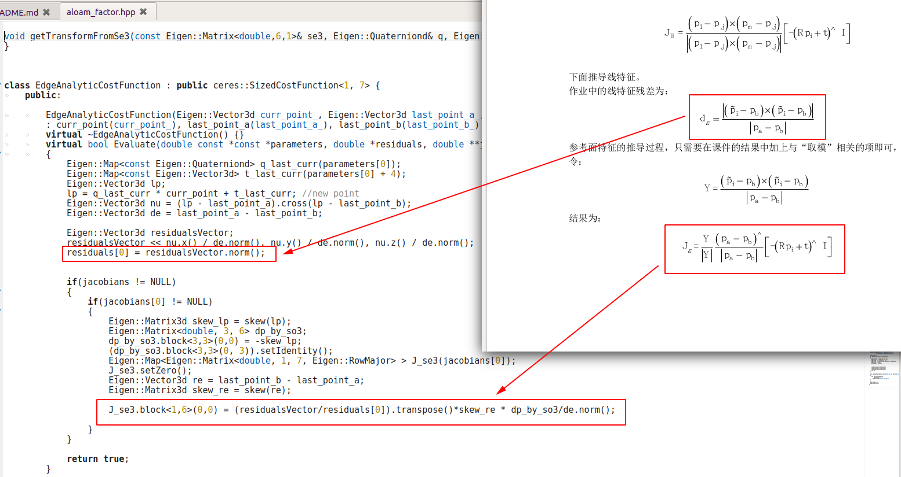
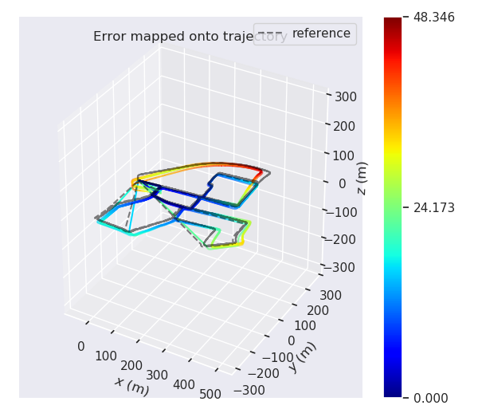
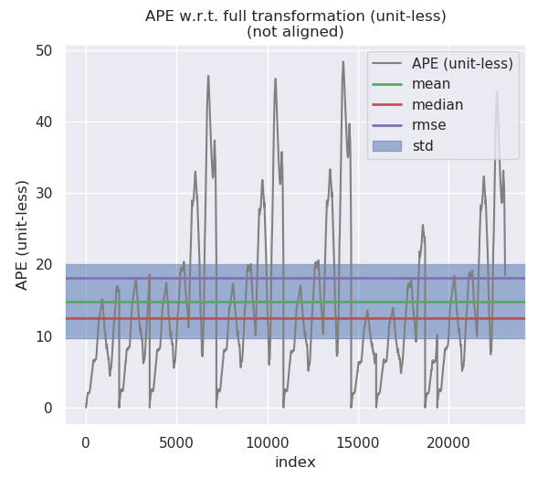
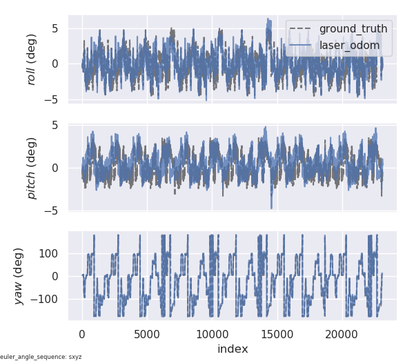
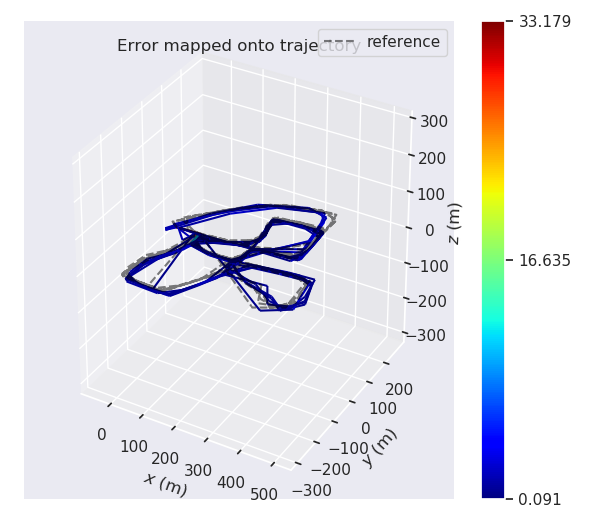
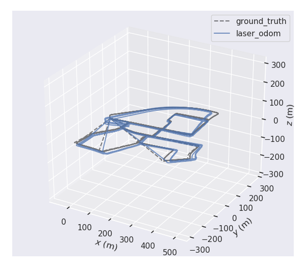
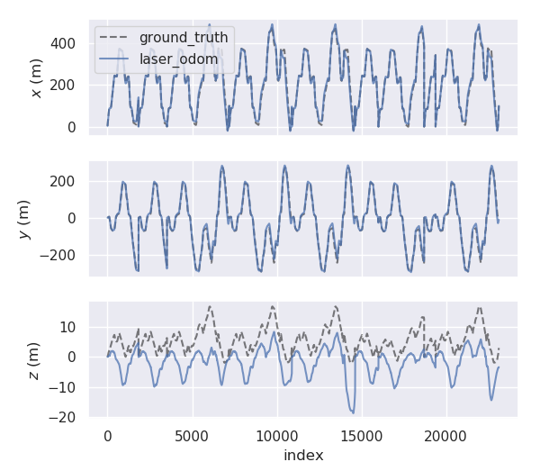

# 深蓝学院《多传感器融合定位》第二期作业

深蓝学院, 多传感器融合定位与建图, 基于线面特征的激光里程计，第3章Lidar Odometry using LOAM代码框架.

---

## Overview

本作业在课程所给代码框架下，按照作业要求改写了F-LOAM中与残差雅可比矩阵的解析实现相关的部分，实现基于线面特征的激光前端里程计算法.

---

## homework

###  推导残差模型的雅可比
见文件夹[点击链接进入](doc/)中的PDF文件《公式推导》

###  公式与代码对应关系
由于F-LOAM代码中的面特征公式与作业要求相同，所以只需要改写线特征公式相关的代码，见图
### 给出新模型基于evo的精度评测结果
见文件夹[点击链接进入](doc/)中的评测结果图:

